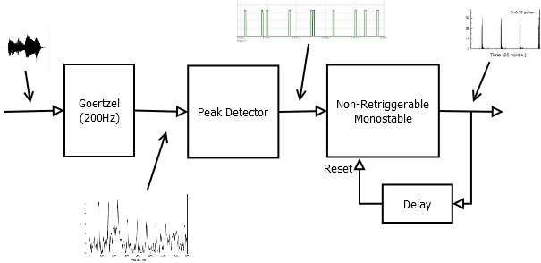

This device follows the beat of the music it hears through its microphone by lighting an LED in rithm with the music. This can serve as a base for light effects that change with music or perhaps a dancing doll.

The device first of all pefroms an FFT on the inconing signal and does peak detection on an FFT bin corresponding to a frequency between roughly 300Hz and 380Hz. This corresponds to a snare drum beat. The peak threshold decays in time so multiple beats can be detected and for each the LED is lit. Once a beat is established the device applys a window around it, in time domain, so that eventual changes in rythm in the song don't cause multiple triggerings. The window constantly adjusts to the current beat so that slides in rythm can be followed.

You can see a video of the device in action here: http://youtu.be/77rwu9_RG3M Note that if you are using bluetooth headphons or your browser is having an hard time keeping the audio and video stream in sync there might be a little lag that maks the LED actually go off with the snare drum hit or even makes it look like the LED is leading the snare. It's just a playback issue, the original video shows the LED pefectly following the snare.

Hardware
===========

The hardware is a Teensy 3.1, which is running an ARM Cortex M4 processor, and its companion audio board that sports a SGTL5000 chip that takes care to handle the analog signal input as well as provides a software controllable microphone pre-amp.

Operating Principle
===========

The diagram below shows the main conceptual components that are implemented in the software that are performing the signal processing. This concerns only the DSP side, so it starts after we have pre-amplified and sampled the signal.

First of all we make an FFT so we can evaluate the energy of the signal in the frequency domain. This allows us to better seprate instruments, since the goal is to detect drums beat. Of all the FFT output we take the energy of a single bin that, in the specific example, sits at a frequency around that of a snare drum. Note that applying Goertzel at this point would be more efficient, I have left the FFT for a first implementation anyhow. 

Once we know how the energy of the snare drums sound evolves in time we pass that through a peak detector. A peak detector holds the maximum value it has seen at its input and, in our implementation, it also outputs a pulse whenever a new maximum is detected. Additionally the detected maximum slowly decays with time so a new beat can be detected but the same one won't retirigger the output.

At this stage we are left with a short pulse per every beat of the snare drum, which could be a good result already to control, for instance, light effects. What I was after though was an actual constant beat syncronized with the rithm of the music. So I added a non retrigerrable monostable block. This has the benefit to lengthen the pulse, first of all, which makes the LED more visible.  Secondly, since it's non retriggerable, it will prevent any beat following the first from retriggering again the output. Of course this sounds like a bad idea, but not if we introduce a delay line that will reset the monostable. How much delay? The delay line starts from a zero delay, so resets the monostable immediately. It then measures the delay between two beats and adjusts itself to slightly lower than that. In this way any irregularity in the drums pattern, which will cause extra beats between the expected ones will be suppressed, but the beat will still be caught if timing is slightly off. Additionally the delay decays if no pulses are detected so that the device can adapt to eventual rythm changes.
